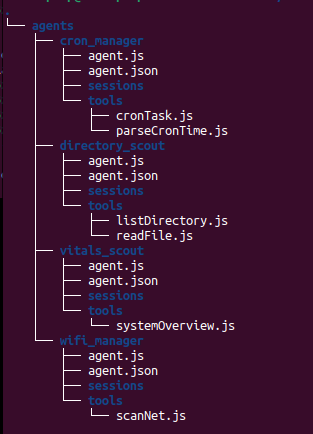

                --- Agent and Tool Directory Structure ---

NOTE:  You must create this directory structure for the runtime. 

  

~/home/user-name/.h1v3/
                  └── agents
                      ├── cron_manager
                      │   ├── agent.js
                      │   ├── agent.json
                      │   ├── sessions
                      │   └── tools
                      │       ├── cronTask.js
                      │       └── parseCronTime.js
                      ├── directory_scout
                      │   ├── agent.js
                      │   ├── agent.json
                      │   ├── sessions
                      │   └── tools
                      │       ├── listDirectory.js
                      │       └── readFile.js
                      ├── vitals_scout
                      │   ├── agent.js
                      │   ├── agent.json
                      │   ├── sessions
                      │   └── tools
                      │       └── systemOverview.js
                      └── wifi_manager
                          ├── agent.js
                          ├── agent.json
                          ├── sessions
                          └── tools
                              └── scanNet.js

                        --- Talk to your agent ---

Once your runtime is running in one terminal, you can interact with any agent using a simple curl POST request.

In another terminal run the command:

curl -X POST http://localhost:3928/agent/directory_scout \
  -H "Content-Type: application/json" \
  -d '{"input": "List the files in /home/user-name/Documents/"}'

                    OR

curl -X POST http://localhost:3928/agent/wifi_manager \
  -H "Content-Type: application/json" \
  -d '{"input":"Scan for available WiFi networks and list them for me in a readable format."}'

                    OR

curl -X POST http://localhost:3928/agent/vitals_scout \
  -H "Content-Type: application/json" \
  -d '{"input":"Check my system vitals and summarize them for me."}'

                    OR

( You can use any script/code you want as long as it runs )

curl -X POST http://localhost:3928/agent/cron_manager \
  -H "Content-Type: application/json" \
  -d '{"input":"Schedule /home/user-name/any_script.py to run only once at 4:36pm MST."}'

If everything is set up correctly, you’ll receive a JSON response containing the agent’s final answer.

                                    ===============================
                                    === HAPPY H1V3 BUILDING !!! ===
                                    ===============================

